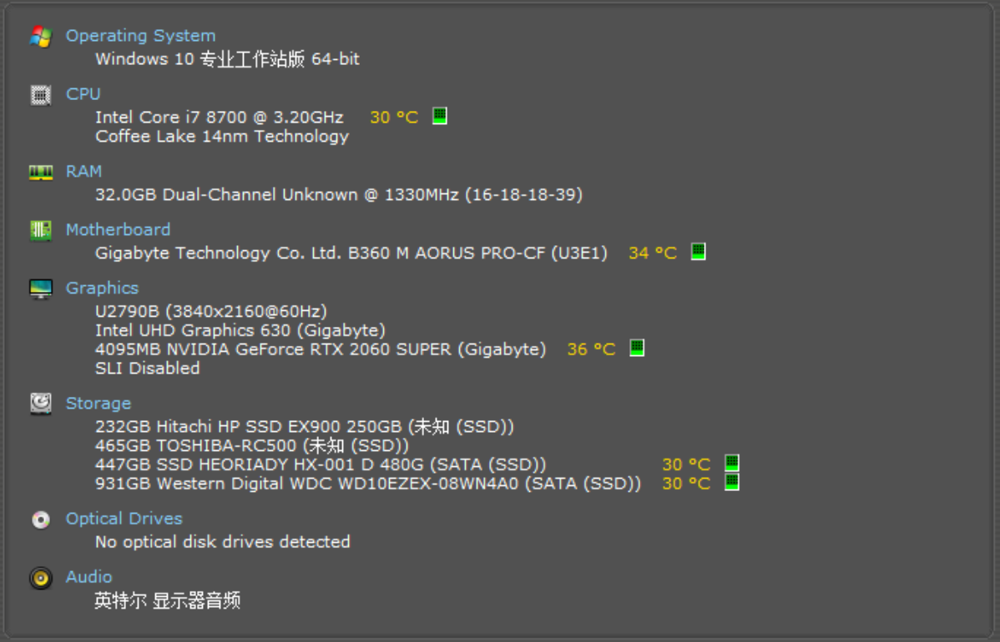

# GIGABYTE-B360M_AORUS_PRO-8700-Hackintosh-OpenCore-EFI

技嘉 B360M AORUS PRO / i7-8700 UHD630 / macOS 11.0 Big Sur / macOS 10.15 Catalina / 黑苹果 OpenCore EFI / GIGABYTE B360M AORUS PRO Hackintosh OpenCore EFI

## 文件详情

- `EFI`, 无AWAC，有Wifi和蓝牙，GIGABYTE B360M AORUS PRO 专用。
- `EFI-AWAC`, 有一个通用AWAC，有Wifi和蓝牙。
- `EFI-NoWifi`, 无AWAC，无Wifi和蓝牙，GIGABYTE B360M AORUS PRO 专用。
- `EFI-AWAC-NoWifi`, 有一个通用AWAC，无Wifi和蓝牙。

对于Wi-Fi和蓝牙，可以自己删除和添加kext，同时修改config.pdist。

## 硬件配置

- 已通过启动参数`-wegnoegpu`屏蔽独显
- 强烈建议使用DP输出
- 已使用AirportItlwm.kext支持CNvi无线网卡蓝牙,[详情](https://github.com/OpenIntelWireless/itlwm)
- 已删除SSDT-AWAC.aml。几乎网上所有教程都说300系主板一定需要该补丁，但我在`技嘉 B360M AORUS PRO`通过SSDTime发现其并没有AWAC时钟，不需要该补丁。而且更重要的是AWAC补丁会导致BIOS时间不更新，进而造成Win时间不走（非时区问题）。如果之前使用过AWAC，而且出现了win下时间不走的问题，只能扣主板电池重置BIOS。
- 通过删除config中的`PciRoot(0x0)/Pci(0x2,0x0)`下的`AAPL,slot-name`,实现了HD630 4k HEVC加速。



## BIOS 设置

参考：[intel-bios-settings](https://dortania.github.io/OpenCore-Install-Guide/config.plist/coffee-lake.html#intel-bios-settings)

### Disable

- Fast Boot
- Secure Boot
- Serial/COM Port
- Parallel Port
- VT-d (can be enabled if you set DisableIoMapper to YES)
- CSM
- Thunderbolt(For initial install, as Thunderbolt can cause issues if not setup correctly)
- Intel SGX
- Intel Platform Trust
- CFG Lock (MSR 0xE2 write protection)(This must be off, if you can't find the option then enable both AppleCpuPmCfgLock and AppleXcpmCfgLock under Kernel -> Quirks. Your hack will not boot with CFG-Lock enabled)

### Enable

- VT-x
- Above 4G decoding
- Hyper-Threading
- Execute Disable Bit
- EHCI/XHCI Hand-off
- OS type: Windows 8.1/10 UEFI Mode
- DVMT Pre-Allocated(iGPU Memory): 64MB
- SATA Mode: AHCI

> boot item: BOOT/BOOTx64.efi

## 关闭或打开 SIP

参考：[disabling-sip](https://dortania.github.io/OpenCore-Install-Guide/troubleshooting/extended/post-issues.html#disabling-sip)

通过设置`config.plist`中的`csr-active-config`来开启或关闭SIP，默认为`00000000`。

```shell
NVRAM -> Add -> 7C436110-AB2A-4BBB-A880-FE41995C9F82 -> csr-active-config
```

- `00000000` - 完全开启 SIP。SIP completely enabled (0x0).
- `03000000` - 关闭 kext 签名和文件系统保护。Disable kext signing (0x1) and filesystem protections (0x2).
- `FF030000` - 关闭 High Sierra 的 SIP。 Disable all flags in macOS High Sierra (0x3ff).
- `FF070000` - 关闭 Mojave 和 Catalina 的 SIP。Disable all flags in macOS Mojave and in macOS Catalina (0x7ff) as Apple introduced a value for executable policy.
- `FF0F0000` - 关闭 Big Sur 的 SIP。Disable all flags in macOS Big Sur (0xfff) which has another new flag for authenticated root.

### 若想创建系统启动快照，还需要关闭`authenticated-root`

从opencore的启动菜单中进入Recovery，打开实用工具-终端，执行下面两句命令：

```shell
csrutil disable
csrutil authenticated-root disable
```

## 截图


